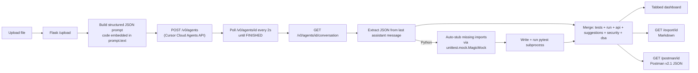
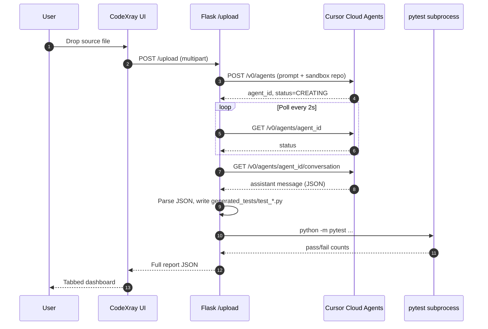

<div align="center">

# CodeXray

### Drop in any source file → AI test plan, API docs (Postman), security & DSA review. Powered by Cursor.

[](https://www.python.org/)
[](https://flask.palletsprojects.com/)
[](https://cursor.com/docs/background-agent/api/endpoints)
[](https://schema.getpostman.com/json/collection/v2.1.0/collection.json)
[](https://docs.pytest.org/)
[](#-license)

**Upload code. Get a full QA + security + API + algorithms report in ~90 seconds.**

[Quick start](#-quick-start) · [Features](#-features) · [Architecture](#-architecture) · [API reference](#-http-api-reference) · [Demo flow](#-demo-flow) · [Troubleshooting](#-troubleshooting)

</div>

---

## Why CodeXray?

LLM-based code analysis usually stops at "here are some test ideas". CodeXray goes the full distance:

- It actually **runs the tests it generates** (real `pytest` subprocess, real pass/fail counts).
- It mines your code for **HTTP endpoints + outbound calls** and ships a ready-to-import **Postman collection**.
- It surfaces **security findings with CWE references**, **DSA improvements with complexity arrows**, and **logic suggestions with side-by-side diffs** — not bullet lists.
- Everything lives in **one tabbed dashboard** with a Markdown export for offline judging.

All powered by the [Cursor Cloud Agents API](https://cursor.com/docs/background-agent/api/endpoints) — no other LLM provider involved.

---

## Features

| | Section | What you get |
|---|---|---|
| 📝 | **Summary** | 3–5 sentence overview, language detection, and notable concerns |
| 📊 | **Quality Score** | 0–100 overall + breakdown bars for *readability · maintainability · complexity · testability* |
| 🧪 | **Test Cases** | AI-generated **functional / edge / negative** cases — name, description, inputs, expected output, full pytest snippet |
| ⚡ | **Test Run** | Real pytest execution with auto-stubbed third-party imports → pass / fail / error / skipped counters + per-test status table |
| 🌐 | **API Details** | Detected endpoints (method, path, headers, params, body, sample responses) **+** outbound HTTP calls. **One-click Postman v2.1 export.** |
| 💡 | **Suggestions** | Logic / readability / maintainability rewrites with `before` / `after` diffs, severity, and impact |
| 🔒 | **Security** | Vulnerabilities with severity (`critical`–`info`), category (auth / injection / crypto / secrets / xss / csrf), CWE id, hardened code, OWASP refs |
| 🧠 | **DSA Improvements** | Algorithm rewrites with `current → improved` complexity (e.g. `O(n²) → O(n)`), data-structure swaps, and concrete impact numbers |
| 📥 | **Exports** | One-click **Markdown report** + **Postman collection** download |

---

## Architecture



Key design decisions:

- **No fallback LLM** — strict Cursor-only. If the agent or repo is misconfigured we fail loudly so judges can verify.
- **Async-correct** — the Cloud Agents API returns `CREATING` immediately, so we always poll `/v0/agents/{id}` until a terminal status before reading the conversation. (This is what most "Cursor API hello world" snippets get wrong.)
- **Auto-stubbed dependencies** — the test runner detects every top-level import in your file and replaces missing third-party packages with `MagicMock` so tests can run without you `pip install`-ing every transitive dep.
- **Reloader off** — `app.run(use_reloader=False)` prevents Werkzeug from killing the in-flight request when we write the new pytest file mid-flight.

---

## Quick start

### 1 · Prerequisites

- Python 3.10+
- A Cursor account with **Cloud Agents** access — [generate an API key](https://cursor.com/dashboard/integrations)
- A GitHub repo the key can access, with **at least one commit on `main`** (the Cursor API rejects empty repos)

### 2 · Install

```powershell
cd CodeXray-CursorHackathon
pip install -r requirements.txt
```

### 3 · Configure `.env`

| Variable | Value |
| --- | --- |
| `CURSOR_API_KEY` | From <https://cursor.com/dashboard/integrations> |
| `CURSOR_REPO_URL` | e.g. `https://github.com/<you>/CodeXray-sandbox` (any repo your key can access; must have a commit on `main`) |
| `CURSOR_MODEL` | `default`, or any id from `GET /v0/models` (e.g. `claude-4.5-sonnet-thinking`) |
| `CURSOR_TIMEOUT_SECONDS` | `120` (bump to `240` for very large files) |

### 4 · Run

```powershell
python app.py
```

Open <http://127.0.0.1:5000> and drop a source file onto the dashboard.

> Sanity-check setup at <http://127.0.0.1:5000/health> — should return `cursor_key_configured: true`.

---

## Demo flow

> Best file to demo: a small Flask app with auth — every section lights up.



Walk judges through the tabs in this order: **All → Quality → Test Cases → Test Run → API Details → Security → DSA**. Then click **Postman** to export and import into Postman live, and **Markdown** to download the offline report.

---

## HTTP API reference

| Method | Path | Purpose |
| :---: | --- | --- |
| `GET` | `/` | Dashboard UI |
| `POST` | `/upload` | Multipart upload → returns full report JSON |
| `GET` | `/report/<id>` | Re-fetch a previously generated report (in-memory cache) |
| `GET` | `/export/<id>` | Download the report as **Markdown** |
| `GET` | `/postman/<id>` | Download a **Postman v2.1** collection |
| `GET` | `/health` | Sanity check: key configured? repo? model? |

### Sample report JSON shape

<details>
<summary>Click to expand the schema returned by <code>POST /upload</code></summary>

```jsonc
{
  "id": "ab12cd34ef56",
  "filename": "auth_routes.py",
  "language": "python",
  "agent_id": "bc-...",
  "agent_status": "FINISHED",
  "agent_url": "https://cursor.com/agents?id=bc-...",
  "summary": "...",
  "quality_score": 78,
  "quality_breakdown": { "readability": 80, "maintainability": 72, "complexity": 75, "testability": 85 },
  "test_cases": {
    "functional": [{ "name": "test_...", "description": "...", "inputs": "...", "expected": "...", "pytest_code": "..." }],
    "edge":       [],
    "negative":   []
  },
  "test_run": {
    "ran": true, "passed": 8, "failed": 1, "errors": 0, "skipped": 0, "total": 9,
    "tests": [{ "name": "test_...", "status": "PASSED" }],
    "summary_line": "8 passed, 1 failed in 0.42s"
  },
  "api_documentation": {
    "has_api": true,
    "framework": "flask",
    "base_url_hint": "http://localhost:5000",
    "endpoints": [{ "method": "POST", "path": "/login", "name": "...", "headers": [], "body": {}, "responses": [] }],
    "external_calls": [{ "method": "POST", "url": "https://api.example.com/...", "purpose": "..." }]
  },
  "suggestions":      [{ "title": "...", "category": "logic", "severity": "medium", "where": "...", "before": "...", "after": "...", "impact": "..." }],
  "security":         [{ "title": "...", "severity": "high", "category": "auth", "cwe": "CWE-256", "before": "...", "after": "...", "references": [] }],
  "dsa_improvements": [{ "title": "...", "current_complexity": "O(n^2)", "improved_complexity": "O(n)", "before": "...", "after": "...", "impact": "..." }]
}
```
</details>

---

## How testing actually works

1. The agent returns a `pytest_code` snippet for each test case.
2. The backend assembles a single combined file at `generated_tests/test_<module>.py` containing:
   - a `sys.path` shim pointing to `uploads/`,
   - **auto-stubs** for every top-level import in the uploaded source that isn't installed (`chromadb`, `openai`, `flask_cors`, `ollama`, …) — replaced with `unittest.mock.MagicMock` so `import target_module` doesn't blow up,
   - a built-in `test_module_imports` smoke test.
3. `python -m pytest` is invoked as a subprocess (60 s timeout). Stdout is parsed for `PASSED|FAILED|ERROR|SKIPPED` per test plus the trailing summary line.

For maximum fidelity, install the real deps your code uses (`pip install chromadb flask-cors ollama …`) — auto-stubs only fire for genuinely missing modules.

---

## Postman export

`/postman/<id>` returns a **Postman Collection v2.1** with:

- One request per detected endpoint — method, path, headers, query/path params, body, sample responses
- A `{{baseUrl}}` collection variable pre-filled with the agent's `base_url_hint`
- A separate folder for **External APIs (consumed by code)** — every outbound HTTP call from your file with the real URL, method, auth and headers

Drop the JSON into Postman → File → Import.

---

## Troubleshooting

<details>
<summary><b>"Resource not found: Failed to fetch branch/tag ref main from GitHub"</b></summary>

Your `CURSOR_REPO_URL` repo has zero commits. The Cloud Agents API can't clone an empty repo. Push any single commit to `main` (a `README.md` is enough).
</details>

<details>
<summary><b><code>ERR_CONNECTION_RESET</code> on <code>/upload</code> after agent finishes</b></summary>

Flask's debug auto-reloader is killing the worker when we write `generated_tests/*.py` mid-request. CodeXray already disables this with `use_reloader=False`. If you re-enabled it, turn it off.
</details>

<details>
<summary><b>All 13 tests fail with <code>ModuleNotFoundError</code></b></summary>

Your uploaded file imports a third-party library that isn't installed in the runner's venv. CodeXray auto-stubs missing imports with `MagicMock`, but if you've removed the auto-stub block, either `pip install` the dep or restore the stubbing logic in `build_pytest_file`.
</details>

<details>
<summary><b><code>CRYPT_E_NO_REVOCATION_CHECK</code> when curl-ing Cursor API on Windows</b></summary>

Windows `curl.exe` uses Schannel, which requires CRL/OCSP servers reachable. Add `--ssl-no-revoke` or use `Invoke-RestMethod` instead. **The Flask app is unaffected** — Python `requests` uses OpenSSL.
</details>

<details>
<summary><b>"Could not parse strict JSON from the agent's reply"</b></summary>

The model returned prose instead of a fenced JSON block. The dashboard surfaces the raw response. Re-run, or tweak the `PROMPT_TEMPLATE` in `app.py` to be more emphatic about format.
</details>

---

## Project layout

```
.
├── app.py                # Flask backend, Cursor client, pytest runner, Postman + Markdown exports
├── templates/
│   └── index.html        # Single-page tabbed dashboard
├── requirements.txt
├── .env                  # CURSOR_API_KEY, CURSOR_REPO_URL, CURSOR_MODEL, ...
├── uploads/              # Saved uploaded files (also added to sys.path for tests)
├── generated_tests/      # AI-generated pytest files (regenerated on each upload)
└── README.md
```

---

## Tech stack

| Layer | Tools |
| --- | --- |
| Backend | Python · Flask · `requests` · `python-dotenv` · `pytest` |
| AI | Cursor Cloud Agents API (`/v0/agents`, `/v0/agents/{id}`, `/v0/agents/{id}/conversation`) |
| Frontend | Vanilla HTML / CSS / JS — no framework, no build step |
| Exports | Postman v2.1 JSON · Markdown |

---

## Roadmap

- [ ] Persist reports to disk so they survive server restarts
- [ ] Streaming progress updates (Cursor `webhook` instead of polling)
- [ ] Run JS / TS tests via `node --test` or `vitest`
- [ ] OpenAPI 3.1 export alongside Postman
- [ ] Multi-file upload + cross-module analysis
- [ ] Side-by-side report comparison across two commits

---

## Acknowledgements

- [Cursor](https://cursor.com) — for the Cloud Agents API powering every section.
- [pytest](https://docs.pytest.org/) — for fast, embeddable test execution.
- [Postman](https://www.postman.com/) — for the v2.1 collection schema.

---

## Fork and Star the repo

<div align="center">

Built for the Cursor AI Hackathon · 2026

</div>
